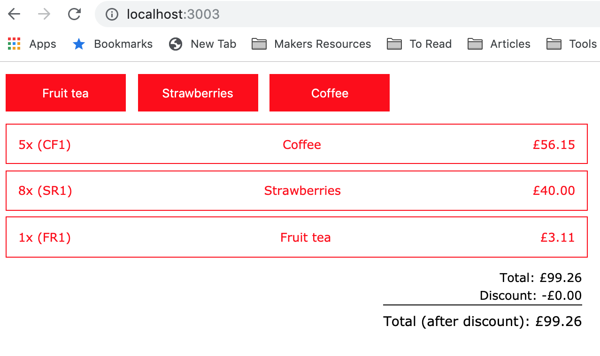

# ACME Supermarket

Create a solution for the ACME Supermarket problem.

## Description of the problem

ACME's quest for global domination has prompted us to open a supermarket – we sell only three products:

    Product code        Name            Price

    FR1                 Fruit tea       £ 3.11
    SR1                 Strawberries    £ 5.00
    CF1                 Coffee          £11.23

Our CEO is a big fan of buy-one-get-one-free offers and of fruit tea. He wants us to add a rule to do this.

The COO, though, likes low prices and wants people buying strawberries to get a price
discount for bulk purchases. If you buy 3 or more strawberries, the price should drop to £4.50.
Our check-out can scan items in any order, and because the CEO and COO change
their minds often, it needs to be flexible regarding our pricing rules.

The interface to our basket looks like this (shown in JavaScript):

    var basket = new Basket(pricingRules)
    basket.add(item)
    basket.add(item)
    var price = basket.total()

Implement a basket system that fulfills these requirements in JavaScript.

Test Data:

    Basket: FR1, SR1, FR1, CF1
    Total price expected: £19.34

    Basket: FR1, FR1
    Total price expected: £3.11

    Basket: SR1, SR1, FR1, SR1
    Total price expected: £16.61

# Installation

- `git clone acme-supermarket` the project
- `cd acme-supermarket` change to folder
- `npm i` to install all dependecies
- `npm run start` to start app
- visit `http://localhost:3003/` to see app

## Technology and tasks completed

- setting generic UI, components based
- used hooks e.g. useState, useContext, useReducer
- Parcel bundling

## To be done

- refactor and split to atomic design
- general refactor, some repetition with utils
- add removal button to ShoppingList (to remove items if needed)
- apply proper styling Sass or styled components, remove inline
- write Jest test
- write Cypress tests
- build Node/Express endpoint and PricingPanel

## Screenshot

